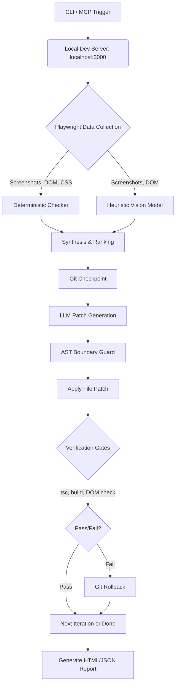

# Elevate: Web Design Refinement Engine - Architecture Document

## 1. Product Overview
Elevate is a closed-loop web design refinement engine tailored for Next.js/React/Tailwind CSS stacks. AI coding agents often produce functionally correct but visually generic UI ("AI slop"). Elevate addresses this gap by binding a headless browser to localhost, performing multi-viewport visual inspections, generating localized LLM patches, and ensuring safety through a Git-backed rollback mechanism on regression. It is delivered as a 100% local CLI tool and an MCP server.

## 2. Proposed System Architecture
Elevate is an orchestration pipeline that chains rendering, analysis, code patching, and verification.
- **Environment:** 100% local execution. No cloud backend, DB, or auth.
- **Target Stack:** Next.js (App Router) + Tailwind CSS only for v0.1.
- **Control Flow:** Multi-pass "improve-until-better" loop.

## 3. Module Boundaries
Based on the v0.1 scope, the system is divided into modular packages:
- `cli/`: Handles user input, options parsing, orchestration of the 'audit', 'improve', 'verify' and 'compare' commands.
- `browser/`: Manages Playwright lifecycle, hooks to `localhost:3000`, extracts DOM, Computed CSS, and takes screenshots.
- `analysis/`: Contains the deterministic checkers (Axe-core, overflow checks) and heuristic visual evaluation (multimodal model prompts).
- `agent/`: Manages LLM patch generation, constraint enforcement, and AST boundary checking.
- `safety/`: Manages Git checkpoints, rollbacks, and triggers build assertions (`tsc`, framework builds).
- `reports/`: Generates visual diffs (HTML) and JSON logs.
- `mcp/`: Exposes CLI capabilities as a Model Context Protocol server.

## 4. CLI Architecture
- Built with a modern Node.js CLI framework.
- Commands: `audit`, `improve`, `verify`, `compare`.
- Connects to an already-running local dev server (default `http://localhost:3000`).
- Provides real-time console feedback on passes, issues flagged, patches applied, and rollbacks.

## 5. Browser/Playwright Architecture
- **Engine:** Headless Chromium via Playwright.
- **Viewports:** Scans across three breakpoints by default: Mobile (375px), Tablet (768px), Desktop (1440px).
- **Data Collection:** Extracts screenshots, DOM structure, computed CSS, bounding rects (via CDP), and accessibility trees.

## 6. Deterministic Analysis Architecture
Evaluates hard rules that have binary pass/fail criteria.
- **Metrics:** Horizontal overflow, WCAG AA contrast, touch target sizes, broken images, semantic header nesting, CLS.
- **Implementation:** Custom Playwright scripts and Axe-core integration.

## 7. Visual Heuristic Analysis Architecture
- **Engine:** Swappable/configurable multimodal vision model.
- **Metrics:** Visual hierarchy, focal clarity, typographic contrast, repetition, negative space, brand rhythm.
- **Output:** Structured JSON output prioritizing 3-5 ranked mutations to fix "AI slop" characteristics.

## 8. Patch-Generation Architecture
- **Strategy:** Targeted unified-diff patches (LLM patch + AST boundary guard) scoped to a single component.
- **Constraint:** Never perform unrestricted full-file rewrites by default. Mitigates the risk of dropping state hooks, routes, comments, or non-UI code.
- **Validation:** Ensures proposed modifications stay strictly within the target JSX/Tailwind scope.

## 9. Git Checkpoint and Rollback Architecture
- **Mandatory Guardrail:** Operates exclusively in a Git-tracked directory.
- **Pre-mutation:** Captures Git HEAD state (or uses `git stash`).
- **Post-mutation/Verification Failure:** Issues an immediate `git checkout .` (or `git reset --hard`) to revert any applied code changes if the safety gates fail.

## 10. Verification Architecture
The safety net post-mutation, occurring before the decision gate:
1. `tsc --noEmit` + Framework build (Next.js build dry-run).
2. DOM smoke test (ensure React bindings/event handlers are retained).
3. Deterministic regression check (a11y, overflow).

## 11. Improve-Until-Better Loop
1. **Render & Analyze:** Gather UI issues (deterministic + heuristic).
2. **Patch & Apply:** LLM generates diff; system applies it.
3. **Verify:** Run verification suite.
4. **Decision:** If verification fails, rollback. If successful, capture "after" state.
5. **Iterate:** Repeat until max passes are reached or heuristic target is satisfied.

## 12. Report Format
- **HTML Visual Diff:** A generated `./elevate-report/summary.html` showing side-by-side (before/after) screenshots per viewport.
- **JSON Logs:** Machine-readable logs of deterministic issues, applied patches, and convergence steps.

## 13. MCP Architecture
- **Integration:** Exposes Elevate's functionality as an MCP server.
- **Capabilities:** Allows external agents to trigger an audit, propose a patch, and utilize Elevate's verification loop.
- **Tools provided:** `run_visual_audit`, `apply_verified_patch`.

## 16. Data-Flow Diagram

